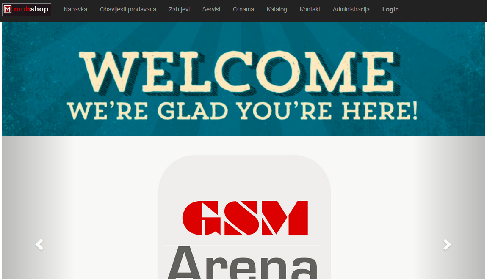
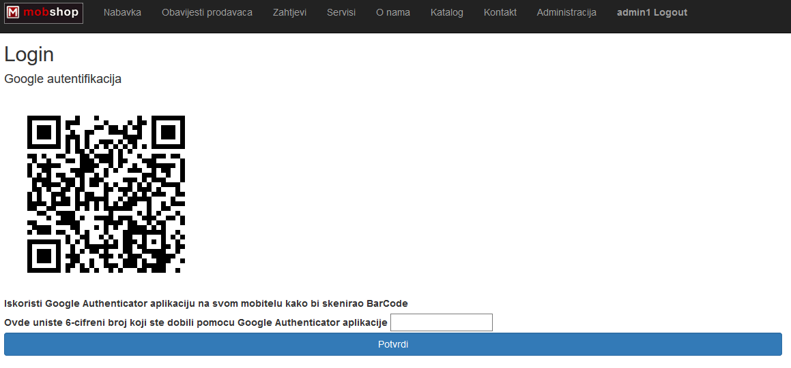
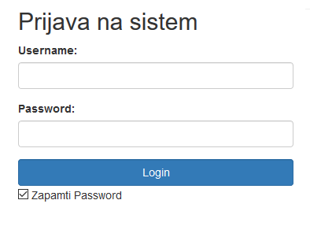
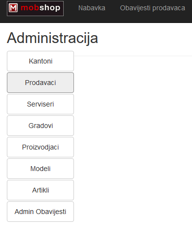
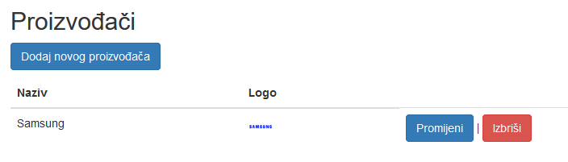
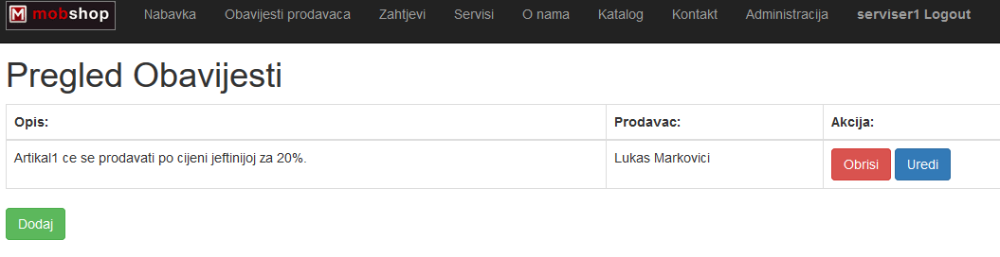
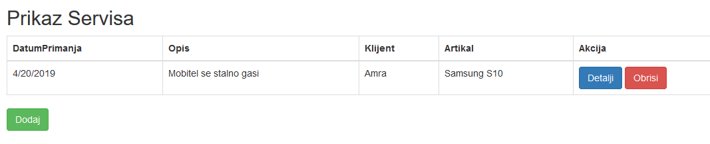
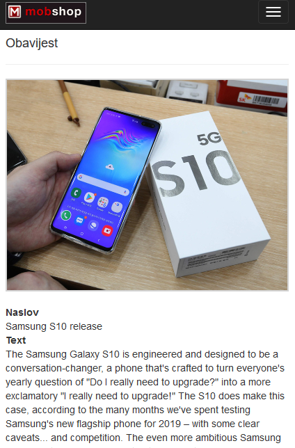

# MobileShopWebApp
  

.Net Core, Entity Framework, MVC, JavaScript(Ajax.js), Bootstrap

Accounts: Admin (username:"Admin1" password:"test"), Seller (username:"Prodavac1" password:"test"), Servicer(username:"Serviser1" password:"test")

Installation required : Google Authenticator Scanner

Some parts of windows and mobile applications:

