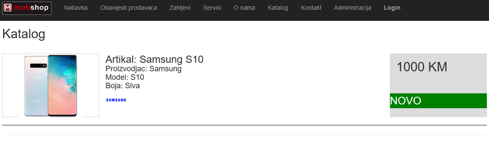

# MobileShopWebApp--NoviProjekat
    MobileShopWeb: (https://p1811.azurewebsites.net/)

.Net Core, Entity Framework, MVC, JavaScript(Ajax.js)

Accounts: Admin (username:"Admin1" password:"test"), Seller (username:"Prodavac1" password:"test"), Servicer(username:"Serviser1" password:"test")

Installation required : Google Authenticator Scanner
Some parts of windows and mobile applications:

